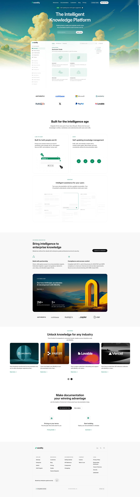

# Mintlify Clone - Documentation Landing Page

A precise desktop-only landing page clone of the [Mintlify](https://mintlify.com) website. This project was developed using **Pure HTML and CSS** to replicate the modern, clean, and developer-focused aesthetic of the original site.

## 🚀 Live Demo

Check out the live version of the project here:
**https://subendermintlify.netlify.app/**

---

## 🖥️ Project Scope (Desktop Only)

> **Note:** This project is specifically designed and optimized for **Desktop Viewports**. It focuses on high-fidelity layout replication and complex CSS positioning.

### Sections Recreated

- **Sticky Navigation:** A transparent-to-solid blur navigation bar with a multi-column dropdown structure.
- **Hero Section:** Replicated the gradient text effects, the "Get Started" CTA, and the modern minimalist layout.
- **Feature Grid:** Custom-styled cards showcasing Mintlify's unique iconography and hover effects.
- **Integrations Section:** Recreated the grid of logos and partnership components.

---

## 🎨 Design Details

### Fonts

- **Primary Font:** 'Inter', sans-serif (used for its high readability and professional feel).

### Colors Used

The project utilizes the signature Mintlify "Light/Modern" palette:

- **Background:** `lab(100% 0 0)`
- **Primary Brand Color:** `lab(2.42579% -0.165291 -0.470081)`
- **Accent Green:** `lab(51.3415% -41.5657 15.3527)`
- **Subtle Borders:** `lab(96.6667% -1.3333 -1.3333)`
- **Text (Muted):** `lab(64.748% -16.5291 -16.5291)`

---

## 📸 Screenshots

Here is the final output of the desktop clone:

### Full Page Overview



---

## 📂 Installation & Local Setup

1.  **Clone the Repository:**
    ```bash
    git clone [https://github.com/subender/mintlify-landing-page.git](https://github.com/subender/mintlify-landing-page.git)
    ```
2.  **Navigate to the folder:**
    ```bash
    cd mintlify-clone
    ```
3.  **Run the Project:**
    Open the `index.html` file in your preferred web browser (Chrome/Edge/Safari recommended for desktop view).

---

## 📝 Evaluation Details

- **GitHub Visibility:** Public
- **Tech Stack:** Pure HTML5, CSS3 (No frameworks used)
- **Target Device:** Desktop (1440px width recommended)
